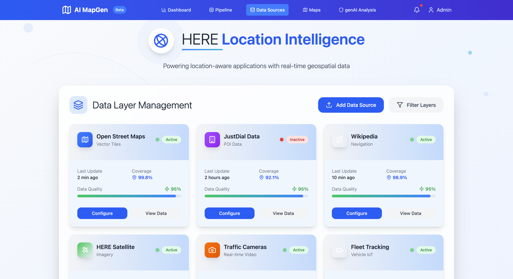

# MapGen

## Overview
This project implements an AI-driven pipeline for updating digital maps using crowd-sourced data. The system leverages modern AI techniques to process, analyze, and integrate various data sources to create and maintain accurate, up-to-date digital maps.

## Features
- **Data Ingestion & Processing**
  - Handles multiple data sources including GPS traces, satellite imagery, and sensor data
  - Automated data cleaning and normalization
  - Integration with OpenStreetMap (Overpass API) for base map data

- **AI-Powered Feature Detection**
  - YOLO-based object detection for map features
  - LLM-based semantic analysis and classification
  - Automated POI (Points of Interest) extraction and validation

- **Map Generation & Visualization**
  - Interactive web interface for map visualization
  - Real-time updates and modifications
  - Custom map styling and feature highlighting

## Project Structure
```
├── client/                 # Frontend React application
├── backend/               # Python-based backend services
│   ├── scrapers/         # Data collection modules
│   ├── utils/            # Utility functions
│   └── sample_data/      # Sample datasets
├── LLM/                  # AI/ML components
│   ├── LLM for geoJSON.ipynb
│   └── Yolo detected to groq.ipynb
└── docker-compose.yml    # Container orchestration
```

## Technology Stack
- **Frontend**: React.js with Mapbox GL
- **Backend**: Python (FastAPI)
- **AI/ML**: 
  - YOLO for object detection
  - LLM (Language Learning Models) for semantic analysis
  - Groq for AI processing
- **Data Processing**: 
  - Overpass API integration
  - GeoJSON handling
  - Custom data scrapers

## Getting Started

### Prerequisites
- Docker and Docker Compose
- Python 3.8+
- Node.js 16+
- API keys for:
  - Mapbox
  - HERE Maps
  - Groq

### Installation
1. Clone the repository:
   ```bash
   git clone [repository-url]
   cd [repository-name]
   ```

2. Set up environment variables:
   ```bash
   cp .env.example .env
   # Edit .env with your API keys
   ```

3. Start the services:
   ```bash
   docker-compose up -d
   ```

### Running Locally
1. Backend:
   ```bash
   cd backend
   pip install -r requirements.txt
   python app.py
   ```

2. Frontend:
   ```bash
   cd client
   npm install
   npm run dev
   ```

## Usage
1. Access the web interface at `http://localhost:3000`
2. Upload or connect data sources
3. Use the AI tools to process and analyze map data
4. View and export the generated map updates

## Contributing
1. Fork the repository
2. Create a feature branch
3. Commit your changes
4. Push to the branch
5. Create a Pull Request

## License
[Add your license information here]

## Acknowledgments
- HERE Maps for geocoding services
- OpenStreetMap for base map data
- YOLO and Groq for AI capabilities 